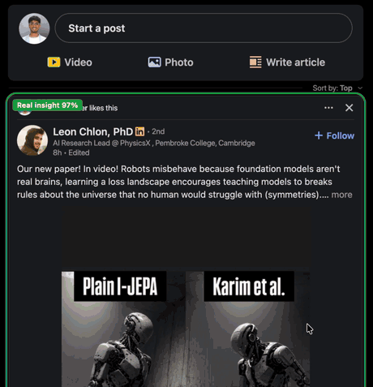

<p align="center">
  
</p>

<h1 align="center">JevedIn</h1>

<p align="center">
  <b>Cut the slop from your LinkedIn feed.</b><br>
  Every post gets a colored label: engagement bait, humblebrag, AI slop, real insight… or categories you invent.
</p>

<p align="center">
  <a href="https://github.com/akshatnerella/jevedin/releases/latest/download/jevedin.zip"><b>⬇ Download</b></a> ·
  <a href="#install">Install</a> ·
  <a href="docs/demo.mp4">Full-quality demo</a> ·
  <a href="https://jev-backend.vercel.app/jevedin/privacy.html">Privacy</a>
</p>

<p align="center">
  
</p>

## What it does

JevedIn draws a colored box around every post in your LinkedIn feed and labels it in under a second, so you can skip straight to the posts worth reading.

| Label | What it catches |
|---|---|
| 🟥 **Engagement bait** | "Agree?", "Comment YES and I'll DM you", tag-three-friends, repost-if-you-care |
| 🟧 **Humblebrag** | "Humbled and honored to announce…", award flexes dressed up as gratitude |
| 🟪 **AI slop** | Generic AI-written listicles and hollow corporate prose |
| 🟫 **Broetry** | One. Line. At. A. Time. Stories with a forced business lesson |
| 🩵 **Hiring** | Job openings, recruiters, open-to-work posts |
| 🟢 **Promotion** | Products, courses, webinars, sponsored posts (blurred by default) |
| 🟩 **Real insight** | Specific, substantive posts with real numbers and detail |
| 🟦 **News** | Funding rounds, launches, layoffs, industry news |
| 🟣 **Personal** | Genuine life and career milestones |

- **Make your own categories.** Want to spot recruiter spam, AI hype or event promos? Add up to 12 of your own, describe them in plain English, and JevedIn sorts your feed by them. There are one-click suggestions too.
- **Choose what each one does:** **Box** it, **Dim** it, **Blur** it until you click, **Hide** it, or turn it **Off**. For example: hide engagement bait, dim humblebrags, keep real insight front and center.
- **Promoted posts stay out of your way.** Anything LinkedIn itself marks as *Promoted* is blurred behind a "click to show" cover.
- **⚡bait** flags posts fishing for engagement, whatever their category.
- **Honest uncertainty.** A dashed box means the model isn't sure; hover any label to see the full breakdown.

## Install

> Chrome Web Store listing coming soon. Until then, it takes about two minutes:

1. **Download** [`jevedin.zip`](https://github.com/akshatnerella/jevedin/releases/latest/download/jevedin.zip) and **unzip** it (double-click on Mac). You'll get a `jevedin` folder.
2. Open your browser's extensions page:
   - Chrome: `chrome://extensions`
   - Brave: `brave://extensions`
   - Edge: `edge://extensions`
   - Arc: `arc://extensions`
3. Turn on **Developer mode** (top-right toggle).
4. Click **Load unpacked** and select the unzipped `jevedin` folder.
5. Open your [LinkedIn feed](https://www.linkedin.com/feed/). Labels appear as you scroll. 🎉

Keep that folder somewhere permanent (not Downloads), because the browser loads JevedIn from it. **To update:** download the new zip, replace the folder's contents, and click ↻ on the JevedIn card.

## Using it

- **Toolbar popup:** live counts for the current page, a quick Box/Dim/Blur/Hide/Off switch per category, and an on/off toggle. Pin JevedIn from the puzzle-piece menu so it's one click away.
- **Settings page** (popup → *Edit categories*): add, rename, recolor and describe categories; **paste any post** to see how it would be labeled; display options.
- **Shortcut:** <kbd>Alt</kbd>+<kbd>Shift</kbd>+<kbd>L</kbd> turns JevedIn on or off anywhere.

## How it works

JevedIn is powered by [**Jev**](https://docs.typesafe.ai), a fast decision model from TypeSafe AI that returns typed answers with calibrated probabilities instead of generating text. Visible posts are sent in small batches to a hosted backend (`jev-backend.vercel.app`), which asks Jev one question per post ("which of these categories fits best?", plus "is this farming engagement?") and returns the probabilities you see in the labels.

Post text is only ever treated as *content to judge*, never as instructions. That matters on LinkedIn, where some posts are written to manipulate AI tools reading the feed.

## Privacy

- No account and no sign-in.
- Reads only the posts shown in your LinkedIn feed: their text, author name and headline, and visible reaction counts.
- Never touches your messages, connections, profile, notifications or any other site.
- Posts are cached by an irreversible fingerprint, not by user. Nothing is sold or shared.

Full policy: [jev-backend.vercel.app/jevedin/privacy.html](https://jev-backend.vercel.app/jevedin/privacy.html)

*JevedIn is an independent project and is not affiliated with or endorsed by LinkedIn.*

## Also by Jev

**[JevTube](https://github.com/akshatnerella/jevtube)** does the same for YouTube: slop, clickbait and ads, labeled before you click.

---

<details>
<summary><b>Development</b></summary>

```
extension/   The MV3 extension (what ships). No secrets in here.
  parse.js   Reads LinkedIn's feed DOM; kept separate so it can be tested on a fixture.
store/       Chrome Web Store listing text, screenshots and promo tile.
tests/       Parser checks and an end-to-end run of the real extension on a feed fixture.
scripts/     package.sh builds dist/jevedin-<version>.zip.
docs/        Demo video and GIF for this README.
```

- **LinkedIn ships hashed class names** (`._48e06e86`) that change on every deploy, so `parse.js` relies only on `data-testid` attributes, aria-labels and link shapes.
- **LinkedIn exposes no stable post id**, so posts are identified by a fingerprint of author + text. The same post gets the same id for everyone, which lets the backend cache work across users.
- **When LinkedIn changes its markup**, update `tests/fixture.html` to mirror the new structure (with made-up people and posts) and re-run the tests. The live feed needs a login, so the tests serve the fixture at `https://www.linkedin.com/feed/` through request interception.

```sh
./scripts/package.sh                         # -> dist/jevedin-<version>.zip
cd tests && npm install && npm test          # parser checks + the real extension on the fixture
```

Load `extension/` with **Load unpacked** while developing, and click ↻ on the card after changes.

</details>
